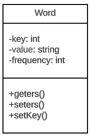

<section>   
    <h1>📢 AEDS: Sistema de sugestão de palavras</h1>   
    

        Criado em setembro de 2023, o projeto de<strong> sugestão de palavras</strong> foi desenvolvido em virtude de atender as demandas do curso de Algoritimo e Estrutura de Dados, ministrado pelo professor <a href="https://www.linkedin.com/in/michelpiressilva/?originalSubdomain=br" target="_blank">Michel Pires Da Silva</a> no Centro Federal de Educação Tecnológica de Minas Gerais (<a href="https://www.divinopolis.cefetmg.br/" target="_blank">CEFET-MG</a>).
    

    

        Vale ressaltar que o sistema de sugestão de palavras é uma continuação do projeto <a href="https://github.com/LuanLuL/AEDS---Top_K_Itens" target="_blank">Top K itens</a>, o qual tem a capacidade de contar as palavras mais frequentes em um texto. Portanto, o sistema de<strong> sugestão de palavras</strong> segue as diretrizes do projeto passado.
    

</section>
<section>
    <h2>🛠 Objetivo</h2>
    

        O objetivo deste projeto é criar uma ferramenta ou programa que, dada uma palavra específica (denominada "busca") e um texto como entrada, seja capaz de gerar sugestões para a próxima palavra que poderia seguir a "busca" com base na análise das palavras mais recorrentes no texto.
    

    

        A utilidade desse projeto pode estar relacionada a várias aplicações, como correção automática de texto, previsão de palavras em campos de busca, sugestão de palavras em aplicativos de mensagens, entre outras. O projeto visa melhorar a experiência do usuário ao ajudar na seleção da próxima palavra em uma frase ou texto, tornando-a mais rápida, precisa e relevante.
    

</section>
<section>
    <h2>🌐 Coleta de dados</h2>
    

        Nesta seção, é descrito o processo de aquisição de dados a partir de um arquivo denominado "pesquisar.txt". Esse arquivo contém um catálogo de palavras-chave que servirão como base para a obtenção de sugestões relacionadas em diversos arquivos de texto, conforme o interesse do usuário.
    

    

        O sistema permite ao usuário especificar uma lista de palavras-chave no arquivo "pesquisar.txt". Nesse sentido, cada palavra a ser buscada deve ser colocada em uma linha separada. Feito isso, o software consiguirá coletar cada palavra-chave e armazena-la temporariamente em uma estrutura de dados interna.
    

    

        No que se refere à inserção de inputs de entrada, segue-se a mesma lógica adotada no projeto anterior (<a href="https://github.com/LuanLuL/AEDS---Top_K_Itens" target="_blank">Top K itens</a>).
    

</section>
<section>
    <h2>🚧 Implementação do Sistema</h2>
    

        Após a leitura do arquivo "pesquisar.txt", o sistema está pronto para iniciar o processo de busca das palavras-chave especificadas e suas respectivas sujestões. Para cada palavra-chave presente na lista, o sistema executa um conjunto de ações bem definidas.
    

    

        Primeiramente, o programa abre cada um dos inputs de entrada disponíveis para busca. No caso de uma palavra-chave não existir em um arquivo específico, o sistema pula automaticamente para o próximo input de entrada, economizando tempo e recursos de processamento. 
    

    

        No entanto, quando uma palavra-chave é encontrada em um arquivo de entrada, o sistema executa a etapa de busca das K palavras mais relevantes dentro do contexto. Este processo implica na execução da tokenização do texto, onde as palavras são divididas em unidades individuais, e posteriormente armazenadas em uma estrutura de dados conhecida como MaxHeap. Isso se deve a necesseidade de contar e registrar as frequências de ocorrência de cada palavra no texto analisado.
    

    

         Tendo identificado as K palavras mais relevantes estas são armazenadas em três diferentes tipos de árvores binária e por fim, após completar o processo de busca, análise e armazenamento de palavras de sugestão, o sistema cria um arquivo de saida chamado "output.txt".
    

</section>
<section>
    <h2>⚙ Estuturas de dados</h2>
    

        As árvores são estruturas de dados fundamentais em ciência da computação, e diferentes tipos de árvores são usados em uma variedade de aplicações. Nesta seção, é apresentado os três tipos  de árvores empregadas nesse software e entender suas características, uso e diferenças.
    

    <ul>
        <li>
            

                <h3>Árvore Binária de busca: </h3> É uma representação hierárquica que é amplamente empregada para a organização e armazenamento eficiente de dados. Ela permite realizar operações de busca, inserção e exclusão em um tempo médio logarítmico, representado como "<i><strong>O(log n)</i></strong>," onde "n" corresponde ao número de nós presentes na árvore (Cormen, 2012).
            

            

                A BST (Binary Search Tree), ou "Árvore de Busca Binária," é uma estrutura de dados hierárquica específica, na qual cada nó possui no máximo dois filhos: um à esquerda (que contém valores menores) e outro à direita (que contém valores maiores). Essa propriedade possibilita uma eficácia notável nas operações de busca. Inicia-se a busca a partir do nó raiz, comparando o valor desejado com o valor do nó atual. Isso permite a realização da renomada busca binária, na qual metade dos dados é descartada a cada iteração (Wikipedia, 2023).
            

            

                Todavia, é importante observar que as BST podem, em determinadas circunstâncias, se tornar desequilibradas, resultando em uma árvore com altura linear, representada como "<i><strong>O(n)</i></strong>," onde "n" corresponde ao número de nós na árvore (Cormen, 2012). Em tais casos, é mais apropriado optar por estruturas balanceadas, como as Árvores AVL. Essas árvores são projetadas para garantir que a altura da árvore permaneça logarítmica, preservando, assim, a eficiência das operações.
            

        </li>
        <li>
            

                <h3>Árvore Adelson-Velsky e Landis: </h3> Também conhecida como AVL, é uma ávore binária de busca, seu diferencial é a capacidade de manter-se automaticamente balanceada. Isso significa que, após cada inserção ou exclusão de um nó, a árvore verifica e ajusta seu balanceamento, garantindo que a altura da subárvore esquerda e da subárvore direita de qualquer nó difira em, no máximo, uma unidade.
            

            

                Com o propósito de manter o equilíbrio, a Árvore AVL, quando desbalanceada, implementa quatro operações distintas durante as fases de inserção e remoção de elementos. Essas operações são as seguintes: Rotação à Esquerda Simples, Rotação à Direita Simples, Rotação à Esquerda-Direita Dupla e Rotação à Direita-Esquerda Dupla.
            

            

                Essas operações de rotação são projetadas para manter a propriedade de balanceamento das Árvores AVL, garantindo um desempenho consistente em operações de busca, inserção e exclusão. Apesar disso, essa eficiência vem com a desvantagem de que as rotações, usadas para manter o balanceamento, podem ser computacionalmente custosas em comparação com árvores binárias de busca simples, e a estrutura requer armazenamento adicional para as alturas dos nós, o que pode aumentar o uso de memória em comparação com estruturas não balanceadas (Cormen, 2012).
            

        </li>
        <li>
            

                <h3>Árvore de Huffman: </h3> Sendo uma árvore binária, a árvore de Huffman é altamente eficiente na compactação de dados, especialmente quando há símbolos com diferentes frequências de ocorrência. Isso a torna ideal para aplicações de compressão, como em formatos de arquivos compactados (por exemplo, ZIP) e transmissão de dados em redes.
            

            

                Sua construção segue um processo iterativo no qual os dois nós com as menores frequências são combinados em um novo nó pai cuja frequência é a soma das frequências dos nós filhos. Esse procedimento é repetido até que reste apenas um nó, que se torna a raiz da Árvore de Huffman.
            

            

                Esse tipo de ávore não é uma estrutura de dados adequada para busca eficiente de dados, ao contrário das Árvores de Busca Binária (BST) e Árvores AVL, que são projetadas especificamente para esse propósito. Portanto, não é uma escolha adequada quando a busca de dados é uma consideração importante.
            

        </li>
    </ul>
</section>
<section>
        <h2>🔠 Objeto Word</h2>
        

            Diferentemente das árvores comuns, nas quais seus nós normalmente contêm apenas um valor, um filho esquerdo e um filho direito, este projeto adota uma abordagem distinta. Em cada nó da árvore, o valor é representado por objetos pertencentes à classe <i><strong>"Word"</strong></i>, os quais possuem uma estrutura definida, conforme ilustrado na Figura 1:
        

        

            
              <strong>Figura 1:</strong> Estrutura da classe Word
        

        

            Com um atributo <i><strong>"key: int"</strong></i> incorporado, a construção da árvore é orientada pelas chaves dos objetos, promovendo uma organização hierárquica que considera o valor da <i>key</i> contida em cada palavra. Esta estratégia foi implementada com o propósito de prevenir a ocorrência de nós duplicados com valores idênticos na árvore. É possível observar como esse atributo é calculado no método <strong><i>"setKey()"</i></strong> apresentado logo abaixo.
        

        <pre><code>
void Word::setKey(string parameter) {
    hash<string> hasher;
    this->key = hasher(parameter);
}
        </code></pre>
        

            O método setKey desempenha um papel crucial na definição da chave (key) para uma instância da classe "Word." Sendo que o processo de construção da chave se baseia na análise do <strong><i>"value: string"</strong></i> fornecida como parâmetro. Nesse sentido, com a finalidade de gerar chaves únicas a partir de strings e com a garantia de que essas chaves não sejam duplicadas, foi empregada a utilização de funções de hash.
        

        

            No contexto da linguagem de programação C++, estão disponíveis bibliotecas de hash padrão, notadamente a biblioteca "functional", que provê a classe std::hash. Esta, por sua vez, realiza a criação de chaves únicas com base em strings de modo que as chaves não se repitam, contribuindo assim para a precisão e eficácia na organização dos elementos presente nas árvores binárias (cplusplus, 2023).
        

</section>
<section>
    <h2>📩 Saida de dados</h2>
    

        O programa de computador, cujo código-fonte se encontra neste repositório, tem como finalidade apresentar potenciais sugestões que estejam associadas a uma palavra de pesquisa, em um conjunto de textos de entrada. Para atender a esse requisito, o programa gera um arquivo de saída denominado "output.txt". Este documento segue um formato específico, no qual cada linha apresenta, respectivamente e separado por "<i>|</i>", informações da seguinte maneira:
    

    <ul>
        <li>
            <strong>INPUT "n"</strong>: Esta seção identifica a entrada específica que está sendo processada, onde "n" é identificador único associado a essa entrada. Isso auxilia no rastreamento e na referência às origens dos resultados;
        </li>
        <li>
            <strong>palavra pesquisada</strong>: Indica a palavra que está sendo pesquisada nos textos. Cada linha de saída corresponde a palavra pesquisada em um texto específico.
        </li>
        <li>
            <strong>frequência da palavra pesquisada</strong>: Esta parte indica quantas vezes a palavra pesquisada ocorre no texto em que foi encontrada. Quando a palavra não está presente no texto, a frequência é definida como 0.
        </li>
        <li>
            <strong>print pre-ordem da árvore binária de busca</strong>: Quando aplicável, esta parte mostra a representação em pré-ordem da árvore binária de busca que contém as "<i>top K</i>" palavras mais frequentes do texto em questão.
        </li>
        <li>
            <strong>print pre-ordem da árvore AVL</strong>: Similarmente à árvore binária de busca, esta seção exibe a representação em pré-ordem da árvore AVL contendo as "<i>top K</i>" palavras mais frequentes do texto.
        </li>
        <li>
             <strong>print pre-ordem da árvore de Huffman (elemento-código de Huffman)</strong>: Quando apropriado, é mostrada a representação em pré-ordem da árvore de Huffman, incluindo códigos de Huffman para as "<i>top K</i>" palavras mais frequentes do texto.
        </li>
    </ul>
    

        Lembrando que em caso de a palavra não ser encontrada no input específico, a impressão das árvores não é necessária, e a saída é simplificada, incluindo apenas informações sobre a entrada, a palavra pesquisada e a frequência igual a 0.
    

</section>
<section>
    <h2>🎞 Processamento</h2>
    

        Durante o deselvovimento do algoritimo apresentado nesse repositório, foi-se utilizado de três principais tecnologias: Visual Studio Code e WSL:Ubunto.
    

    <ul>
        <li>    
            

                O Visual Studio Code é um editor de texto multiplataforma disponibilizado pela Microsoft para o desenvolvimento de aplicações, Conhecer essa ferramenta é importante para os desenvolvedores que pretendem trabalhar em ambientes multiplataforma, por exemplo,  podendo operar o desenvolvimento em ambiente Mac e Linux, ao mesmo tempo em que mantém o projeto compatível com Windows. Segue em anexo o link para o site da plataforma — <a href="https://code.visualstudio.com/" target="_blank">Visual Studio Code</a>.
            

        </li>
        <li>
            

                O WSL é um método para se executar o Sistema Operaciona Linux dentro do Windows de forma muito facil. Essa platoforma se torna essencial para o desenvovimento em ambiente GNU Linux, evitando tarefas como a intalação de maquinas vituais, criação de dual booting no computador pessoal e entre outras coisas. Além disso, existem diversas vantagens como rodar programas em conjunto e compartihamento de localhost. Segue em anexo um  tutorial de download do WSL2 — <a href="https://youtu.be/hd6lxt5iVsg" target="_blank">Tutorial WSL2</a>.
            

        </li>
    </ul>
    

        O programa ainda possui um arquivo Makefile que realiza todo o procedimento de compilação e execução. Para tanto, temos as seguintes diretrizes de execução:
    

    

        <table>
            <thead>
                <tr>
                    <th>Comando</th>
                    <th>Função</th>
                </tr>
            </thead>
            <tbody>
                <tr>
                    <td><code>make clean</code></td>
                    <td>Apaga a última compilação realizada contida na pasta build</td>
                </tr>
                <tr>
                    <td><code>make</code></td>
                    <td>Executa a compilação do programa utilizando o gcc, e o resultado vai para a pasta build</td>
                </tr>
                <tr>
                    <td><code>make run</code></td>
                    <td>Executa o programa da pasta build após a realização da compilação</td>
                </tr>
            </tbody>
        </table>
        

            <b>Tabela 1:</b> Comandos úteis para compilar e executar o programa de computador
        

    

</section>
<section>
    <h2>📚 Referências</h2>
    

        Knuth, Donald E. Fundamental Algorithms. In: The Art of Computer Programming, Vol. 1: Fundamental Algorithms. 3rd ed. Boston: Addison-Wesley, 1997. p. 10-50.
    

    

        Cormen, Thomas H. et al. Algoritmos: Teoria e Prática. 3ª ed. Rio de Janeiro: Elsevier, 2012.
    

    

        Wikipedia. Binary search tree. Disponível em: <a href="https://en.wikipedia.org/wiki/Binary_search_tree">Wikepedia/Binary_search_tree</a>. Acesso em 10 de setembro de 2023
    

    

        cplusplus.com. C++ Reference - <i><strong>Functional Library</strong></i>. Disponível em: <a href="https://cplusplus.com/reference/functional/?kw=functional">https://cplusplus.com/functional/</a>. Acesso em: 20 set. 2023.
    

    

        cplusplus.com. C++ Reference - <i><strong>Functional Library</strong></i>. Disponível em: <a href="https://cplusplus.com/reference/functional/hash/">https://cplusplus.com/functional/hash</a>. Acesso em: 20 set. 2023.
    

</section>
<section>
    

    

          

           Feito por <strong>Luan Gonçalves Santos</strong>     
         

         

          
        
        

    

</section>
